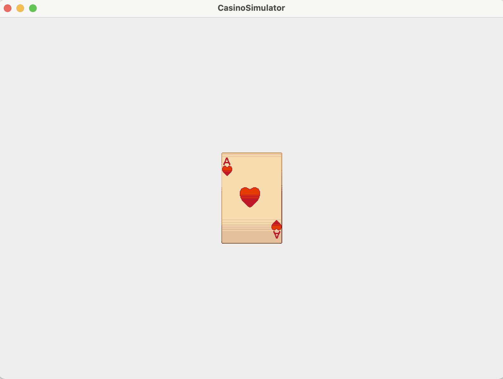

# CasinoSimulator
The program will run a simulation of various games found within a casino. These include standard games such as Slots, Blackjack, etc. The program will have a main menu to select each game and will include a graphical user interface (GUI) to interact with the various games while playing. There will be a free-play mode, where there is infinite money to be played with, and a standard mode with a limited amount of money to start with.



# How to run
- Download Casino.zip from the latest release
- Extract the zip file; there should be a **jar** file and an **Assets** folder
- On the command line navigate to the folder where the files were extracted and run
```
java -jar CasinoSimulator.jar
```
- A window will open with a menu where one can choose which game to play

# How to contribute
Follow this project board to know the latest status of the project: [Trello](https://trello.com/b/EWAn1oRz/casinosimulator-tasks)

### How to build
- Clone main branch into a folder
- Open IntelliJ 11
- Build the project by going to Build -> Build Project
- Now go to File -> Project Structure and then click on Artifacts
- If this is empty click on the + sign and choose JAR -> From modules with dependencies
- Under Main Class select CasinoSimulator then click OK and click OK again
- Now click on Build -> Build Artifacts
- A new folder named **artifacts** will be created under the **out** folder
- Navigate to the last folder and move **CasinoSimulator.jar** to the main directory where the Assets folder is also located
- In the terminal navigate to the main folder and run
```
java -jar CasinoSimulator.jar
```
- Have fun!!!
